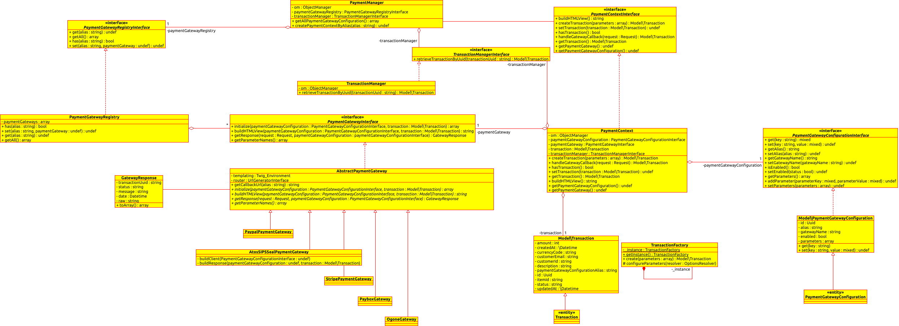

# PaymentBundle

This Symfony bundle provide help for integrating payments solutions by the normalization of payment process thanks to gateways. Each used gateway must have a configuration to set its parameters.

Example controller :

```php
<?php

$paymentContext = $this->paymentManager->createPaymentContextByAlias('stripe_test'); // raw alias

$payment = $paymentContext->createPayment([
    'item_id' => 5,
    'amount' => 500,
    'currency_code' => 'EUR',
]);

return $this->render('@IDCIPayment/payment.html.twig', [
    'view' => $paymentContext->buildHTMLView(),
]);
```

A list of [commands](#command) is provided by this bundle to manage gateway configurations & transactions.

Installation
------------

Add dependency in your ```composer.json``` file:

```json
"require": {
    ...,
    "idci/payment-bundle": "^4.0",
}
```

Install this new dependency in your application using composer:

```bash
$ composer update
```

Enable bundle in your application kernel :

```php
<?php
// config/bundles.php
return [
    // ...
    new IDCI\Bundle\PaymentBundle\IDCIPaymentBundle(),
];
```

Add this to your ```config.yaml``` file

```yaml
# config/packages/idci_payment.yaml
imports:
    - {resource: '@IDCIPaymentBundle/config/config.yaml'}

# Enable monolog logging using event subscriber plugged on transaction state changes
idci_payment:
    enabled_logger_subscriber: true

```

(Optional) If you want to customize the payment logger, by defaults, it will output into main handler

```yaml
# config/packages/monolog.yaml
monolog:
    handlers:
        # ...
        payment_log:
            type: stream
            path: "%kernel.logs_dir%/%kernel.environment%.log"
            channels: ['payment']
```

Install routes in your ```config/routes/idci_payment.yaml``` file:

```yaml
# config/routes/idci_payment.yaml
idci_payment:
    resource: '@IDCIPaymentBundle/config/routing.yaml'
    prefix:   /

idci_payment_api:
    resource: '@IDCIPaymentBundle/config/routing_api.yaml'
    prefix:   /api
```

These tutorials may help you to personalize yourself this bundle:

- [Create a new payment gateway](./docs/create-your-payment-gateway.md): incorporate new payment method to this bundle
- [Create your own transaction manager](./docs/create-your-transaction-manager.md) : help you to retrieve transaction from other stockages methods (default: Doctrine)
- [Use this bundle with step bundle](./docs/use-step-bundle.md): simple configuration to make this bundle work with step bundle
- [Create your own event subscriber](./docs/create-your-event-subscriber.md): learn how to work with transaction event

Supported Gateways
------------------

* [Stripe](./src/Gateway/StripePaymentGateway.php) ([example](./docs/example/stripe.md))
* [Paypal](./src/Gateway/PaypalPaymentGateway.php) ([example](./docs/example/paypal.md))
* [Paybox](./src/Gateway/PayboxPaymentGateway.php) ([example](./docs/example/paybox.md))
* [Monetico](./src/Gateway/MoneticoPaymentGateway.php) (Unsupported for now)
* [Ogone](./src/Gateway/OgonePaymentGateway.php) (Unsupported for now)
* [PayPlug](./src/Gateway/PayPlugPaymentGateway.php) ([example](./docs/example/payplug.md))
* [SystemPay](./src/Gateway/SystemPayPaymentGateway.php) ([example](./docs/example/systempay.md))
* [Sofinco](./src/Gateway/SofincoPaymentGateway.php) ([example](./docs/example/sofinco.md))
* [Sofinco CACF](./src/Gateway/SofincoCACFPaymentGateway.php) ([example](./docs/example/sofinco-cacf.md))
* [Eureka/FloaBank](./src/Gateway/EurekaPaymentGateway.php) ([example](./docs/example/eureka.md))
* [Alma](./src/Gateway/AlmaPaymentGateway.php) ([example](./docs/example/alma.md))
* [ApplePay](./src/Gateway/ApplePayPaymentGateway.php) ([example](./docs/example/apple-pay.md))
* [Atos Sips Bin](./src/Gateway/AtosSipsBinPaymentGateway.php)
    * Mercanet ([example](./docs/example/mercanet-bin.md))
    * Scellius ([example](./docs/example/scellius-bin.md))
    * Sogenactif ([example](./docs/example/sogenactif-bin.md))
* [Atos Sips POST](./src/Gateway/AtosSipsPostPaymentGateway.php)
    * Mercanet ([example](./docs/example/mercanet-post.md))
    * Sogenactif ([example](./docs/example/sogenactif-post.md))
* [Atos Sips JSON](./src/Gateway/AtosSipsJsonPaymentGateway.php)
    * Mercanet ([example](./docs/example/mercanet-json.md))
    * Sogenactif ([example](./docs/example/sogenactif-json.md))
* [Worldline](./src/Gateway/WorldlinePaymentGateway.php) ([example](./docs/example/worldline.md))

For testing purpose:
- [Parameters](./docs/test-parameters.md)
- [Cards](./docs/test-cards.md)

Command
-------

##### PaymentGatewayConfiguration

```bash
# To create a PaymentGatewayConfiguration
$ php bin/console app:payment-gateway-configuration:create

# To show the list of PaymentGatewayConfiguration
$ php bin/console app:payment-gateway-configuration:list

# To update a PaymentGatewayConfiguration
$ php bin/console app:payment-gateway-configuration:update

# To delete a PaymentGatewayConfiguration
$ php bin/console app:payment-gateway-configuration:delete
```

##### Transaction

```bash
# Remove all the aborted transaction created 1 day ago
$ php bin/console app:transaction:clean
```

Tests
-----

Add test routing :

```yaml
# config/routes/dev/idci_payment.yaml

_test_payment:
    resource: '@IDCIPaymentBundle/config/routing_test.yaml'
    prefix:   /_test/

```

You can now test gateways on ```/_test/payment-gateway/select``` (be sure to have created one or more gateway configuration)

Resources
---------

##### UML Diagram


